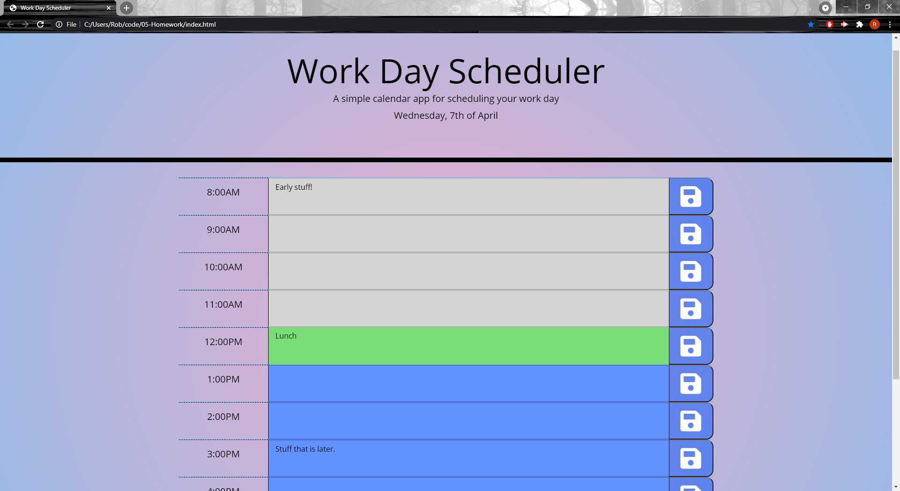

# 05 Third-Party APIs

## Work Day Scheduler

This project was very hard for me to get started, I had to do a few itterations to make it work properly. At first I had designed the whole rows of content in HTML. I had got most of the functions working, as in the the changing of 'past' 'present' and 'future and had got the local storage saving the content.

After my initial solution, I decided to create all the elements in Javascript. This took a while to get used to but became easy as I could comment out the HTML and copy it into javascript and append/add class where necessary. These elements were created in a for loop that iterated over the amount of hours set (8-17). I then used these hours set in the for loop and compared them with the currentTime to then add the class 'past', 'present' or 'future' to the userInput area. Each element, the row, hours, textarea and button were created a set amount of times, and now I worked on having the local storage work. The local storage part of the assignment was by far the hardest to solve. 

Because I had set up the elements in javascript, it was hard to locate individual rows as they were all being treated as a duplicate of the first row. After much time and research, I figured out how to locate the individual save button to properly save each row and have them display after refresh. To do this I got the click event.currentTarget, then went up to the .closest parent which is the .row. Then I got the particular text area through children [1], then got the textarea.value and stored it in the local storage at the current hour. 

This assignment taught me a lot about jQuery as well as moment.js, both of which I had not used before. It has been good to expand my knowledge into how different libraries work and forcing myself to use mostly jQuery was tough at first but became quite quick and easy to navigate. 

Here is a link to my working application: https://robert-rousset.github.io/Daily-Planner/.

And a Screenshot:

